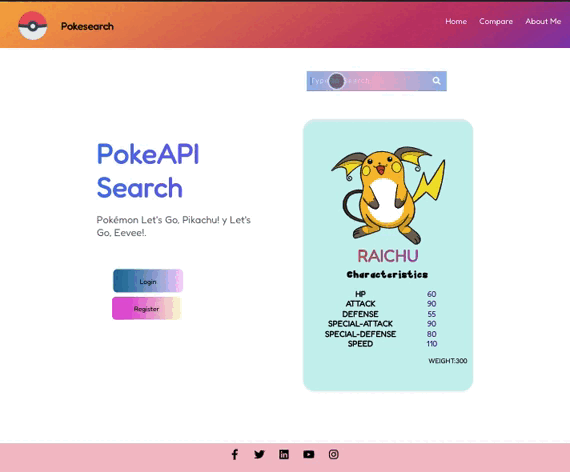

Sprint 9 React API PokemonSearch📌
============

***
## Introducción🚀 

El proyecto "PokeSearch API", es una aplicación web que gestiona a través de una llamada a API en JavaScript para cargar y mostrar una lista de datos de Pokemones.Los usuarios podrán buscar el Pokemon de su elección. Los usuarios podrán generar Registro y Login en LocalStorage.
## Objetivos de la práctica🛫 

1.- Aplicar el Clean Arquitecture.

2.- Aplicar testing a través de React Testing Library.

3.- Repasar arquitectura en componentes(proceso de contrucción de components y su vinculación), 

4.- Repasar Hooks (usestate, useEffect y props de React).

5.- Repasar styled-components.

6.- Utilizar localStorage

7.- Utilizar React-Router-DOM.

8.- ConsumO de datos de una API.

## Estructura 📚 

- Requisitos Funcionales 🎯:

    - Crear almenys 5 components.

    - Usar input i output per a passar dades entre components.
    - Fer servir les rutes.

    - Utilitzar Redux o Context.

    - Cridar mínim a una API externa.

    -  Fer servir serveis per a implementar lògica de negoci i/o anomenades API.

    - Implementar login/registre, idealment amb Firebase, encara que ho pots fer amb localStorage.

    - Protegir les rutes, bé perquè hi hagi un usuari administrador que pot només veure ell una part, o perquè hi hagi usuaris normals i premium.

    - La solució ha d'estar ben maquetada i ser responsive.

    - La solució ha d'estar operativa lliure de bugs, podent el mentor fer un flux d'usuari complet (una acció concreta, si per exemple és un e-commerce, seria fer el procés de compra sencer, des que entra a la web fins que va al pagament).
    
## Comenzando 🚀 
Estas instrucciones te permitirán obtener una copia del proyecto en funcionamiento en tu ordenador local, para propósitos de desarrollo y pruebas:

Abre la terminal y ejecuta:

1. Clone git https://github.com/belcar-ceci/S9.-React-PokeSearch-API.git para descargar el proyecto, realiza un fork.

## Install

- npm install
- npm install --save styled-components

## 🚀 Proyecto en producción

Dónde encontrar el proyecto en producción:

## Versión Desktop 🛰️

  

## Dependencias 🚁
Para el proyecto se utiliza 
* Node Modules.
* Styled-components.
* React Router DOM.
* ReactPlayer.
* React Testing Library.
* CSS
* JS
* HTML
* [PokéAPI 🐢  🐱 ](https://pokeapi.co/api/v2/)

## Herramientas  🧰 

* Miró
* Trello

## Autores🌻 

* Cecilia Carbajal.

## Gratitud 🎁
* Comenta a otros sobre este proyecto 📢 .
* Apoya nuestros proyectos 🐈‍⬛.
* Hecho con  ❤️ por [Ceci Carbel 🐱](https://github.com/belcar-ceci/S9.-React-PokeSearch-API.git)

## Getting Started with Create React App

This project was bootstrapped with [Create React App](https://github.com/facebook/create-react-app).

## Available Scripts

In the project directory, you can run:

### `npm start`

Runs the app in the development mode.\
Open [http://localhost:3000](http://localhost:3000) to view it in your browser.

The page will reload when you make changes.\
You may also see any lint errors in the console.

### `npm test`

Launches the test runner in the interactive watch mode.\
See the section about [running tests](https://facebook.github.io/create-react-app/docs/running-tests) for more information.

